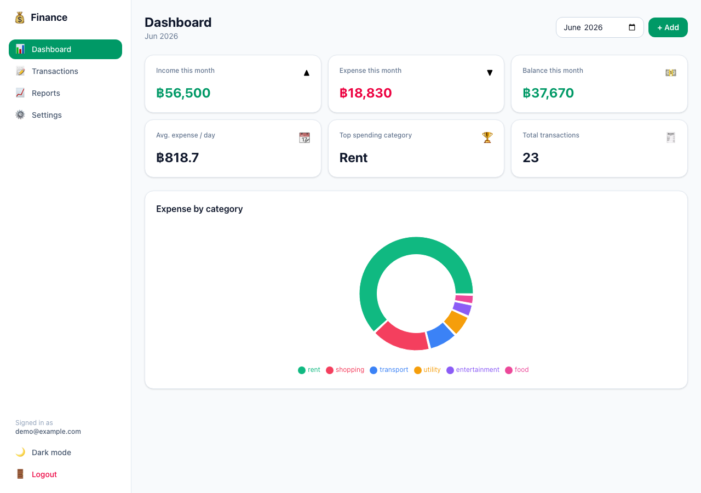

# AI-assisted Personal Finance Tracker

A personal income/expense tracker built on the **Cloudflare free tier**. Record
income and expenses, see a monthly dashboard, browse/filter transactions, view
monthly reports with charts, and export to CSV — all behind a simple password
login.

## Live Demo

- **URL:** _add your `*.workers.dev` URL here after deploying_
- **Login:** the password you set in `ADMIN_PASSWORD` (demo data password is in
  your private notes — never commit it)



## Features

- 🔐 **Login** — single password, stateless signed-cookie session (no secrets in code)
- 📊 **Dashboard** — income / expense / balance, avg expense/day, top category, total count
- 📝 **Add / edit / delete** income & expense transactions (modal form with validation)
- 🔎 **Transaction list** — newest first, filter by type / category / date range, search description
- 📈 **Monthly report** — income/expense/balance per month, computed from real data
- 📉 **Charts** — monthly income-vs-expense bar chart + expense-by-category donut
- ⬇️ **CSV export** — respects active filters, UTF-8 BOM so Thai text opens cleanly in Excel
- 🏷️ **Custom categories** — add/remove your own (Settings)
- 🌙 **Dark mode**, 📱 **fully responsive** (desktop / tablet / mobile)

## Tech Stack

| Layer        | Choice                                              | Why |
|--------------|-----------------------------------------------------|-----|
| Frontend     | **React 19 + Vite + TypeScript**                    | Fast SPA, great DX |
| Styling      | **TailwindCSS 4**                                   | Mobile-first responsive UI quickly, trivial dark mode |
| Charts       | **Recharts**                                        | Declarative React charts |
| Backend API  | **Hono** on **Cloudflare Workers**                  | Tiny, fast router that runs in the same Worker |
| Database     | **Cloudflare D1** (SQLite)                          | Free, serverless SQL, native Workers binding |
| Hosting      | **Cloudflare Workers** + static assets binding      | One Worker serves the SPA **and** the API — no CORS, one deploy |
| Auth         | HMAC-signed session cookie (Web Crypto)             | Stateless → no KV/DB session storage needed |

> **Why one Worker instead of Pages + a separate Workers API?** Serving the SPA
> assets and the API from a single Worker (`run_worker_first: ["/api/*"]`)
> removes CORS entirely, gives one deploy target, and stays comfortably in the
> free tier. See `wrangler.jsonc`.

## Project Structure

```
worker/        Hono API (auth, db query layer, validation, routes)
src/           React app (pages, components, contexts, api client)
shared/        Types shared by BOTH the worker and the frontend
migrations/    D1 schema migrations
seed.sql       Default categories + demo data
scripts/       Playwright screenshot capture
```

## Local Development

Requires **Node 20+**.

```bash
# 1. Install dependencies
npm install

# 2. Create your local secrets file
cp .dev.vars.example .dev.vars
#   then edit .dev.vars and set ADMIN_PASSWORD + SESSION_SECRET

# 3. Create the local D1 database (schema + demo data)
npm run db:migrate:local
npm run db:seed:local        # optional: loads demo transactions

# 4. Start the dev server (Vite + Worker + local D1, all together)
npm run dev
#   → http://localhost:5173
```

## Environment Variables

Secrets are **never** hardcoded. Locally they live in `.dev.vars` (gitignored);
in production they are Wrangler secrets.

| Variable         | Purpose                                            |
|------------------|----------------------------------------------------|
| `ADMIN_PASSWORD` | Password required to log in                        |
| `SESSION_SECRET` | Key used to HMAC-sign session cookies (use a long random string: `openssl rand -base64 32`) |
| `DB` (binding)   | Cloudflare D1 binding, configured in `wrangler.jsonc` |

## Database Migration

Migrations live in `migrations/` and are applied with Wrangler.

```bash
# Local (Miniflare state under .wrangler/)
npm run db:migrate:local
npm run db:seed:local

# Remote (your real Cloudflare D1)
npm run db:migrate:remote
npm run db:seed:remote
```

Schema (see `migrations/0001_init.sql`):

```sql
CREATE TABLE transactions (
  id TEXT PRIMARY KEY,
  type TEXT NOT NULL CHECK (type IN ('income','expense')),
  amount REAL NOT NULL CHECK (amount > 0),
  category TEXT NOT NULL,
  description TEXT,
  transaction_date TEXT NOT NULL,   -- YYYY-MM-DD
  created_at INTEGER NOT NULL,      -- epoch ms
  updated_at INTEGER NOT NULL
);
-- + indexes on type, transaction_date, category
-- + a `categories` table for custom categories
```

## Deploy to Cloudflare

```bash
# 1. Authenticate Wrangler with your Cloudflare account
npx wrangler login

# 2. Create the production D1 database
npx wrangler d1 create finance-tracker
#    → copy the printed "database_id" into wrangler.jsonc (replace the placeholder)

# 3. Apply schema (and optionally demo data) to the remote DB
npm run db:migrate:remote
npm run db:seed:remote        # optional

# 4. Set production secrets (you'll be prompted for the value)
npx wrangler secret put ADMIN_PASSWORD
npx wrangler secret put SESSION_SECRET

# 5. Build + deploy
npm run deploy
#    → prints your live https://finance-tracker.<subdomain>.workers.dev URL
```

### Auto-deploy from GitHub (CI/CD)

Push this repo to GitHub, then in the Cloudflare dashboard:
**Workers & Pages → Create → Connect to Git → select the repo.**
Set the build command to `npm run build` and add `ADMIN_PASSWORD` /
`SESSION_SECRET` as environment secrets. Every push to the main branch then
builds and deploys automatically.

## API Reference

All endpoints are under `/api` and (except auth/health) require a valid session cookie.

| Method | Endpoint                  | Description |
|--------|---------------------------|-------------|
| POST   | `/api/login`              | Log in with `{ password }` → sets session cookie |
| POST   | `/api/logout`             | Clear session |
| GET    | `/api/me`                 | `{ authenticated: boolean }` |
| GET    | `/api/transactions`       | List + filter (`type`,`category`,`start`,`end`,`search`,`limit`,`offset`) |
| POST   | `/api/transactions`       | Create |
| PUT    | `/api/transactions/:id`   | Update |
| DELETE | `/api/transactions/:id`   | Delete |
| GET    | `/api/dashboard?month=`   | Monthly summary (defaults to current month) |
| GET    | `/api/reports/monthly`    | Per-month income/expense/balance |
| GET    | `/api/reports/categories` | Category breakdown (`type`, optional `month`) |
| GET    | `/api/categories`         | List categories |
| POST   | `/api/categories`         | Create custom category |
| DELETE | `/api/categories/:id`     | Delete category |
| GET    | `/api/export.csv`         | CSV export (same filters as list) |

## Cost Summary

Designed to run **entirely on the Cloudflare free tier**:

| Service                  | Free tier (as of 2026)             | How this app stays within it |
|--------------------------|------------------------------------|------------------------------|
| **Workers**              | 100,000 requests/day               | One Worker for SPA + API; static assets are served for free and don't count as Worker invocations |
| **Workers Static Assets**| Unlimited, free                    | The whole React bundle is served as assets |
| **D1**                   | 5 GB storage, 5M rows read/day     | A personal ledger is tiny; indexed queries keep reads minimal |
| **Session storage**      | —                                  | $0 — sessions are **stateless signed cookies**, so no KV/DB writes per request |

No paid services are used. Total expected cost: **$0/month** for personal use.

## AI Usage

This project was built with AI assistance (Claude Code). The tools used, what AI
helped with, example prompts, what was human-reviewed, and a real mistake the AI
made (and how it was fixed) are documented in **[AI_USAGE.md](AI_USAGE.md)**.
